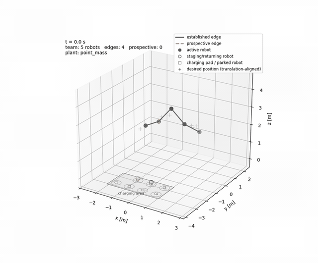

# Safe Formation Control of Open Multi-Robot Systems with Connectivity-Preserving Reconfiguration

Code accompanying the paper **“Safe Formation Control of Open Multi-Robot Systems with Connectivity-Preserving Reconfiguration.”**

This repository implements distributed barrier-Lyapunov-function (BLF) formation control for open multi-robot systems whose members may join and leave during operation. Team reconfiguration is handled through **prospective edges**, auxiliary relaxation dynamics for temporarily enlarged connectivity bounds, and a **make-before-break** strategy for connectivity-critical departures.

<p align="center">
  
</p>

The repository provides four validation levels, from the model analyzed in the paper to full ROS 2/Gazebo simulation:

| Level | Model | Entry point |
|---|---|---|
| Paper model | Double integrator / point mass | `--dynamics point_mass` |
| Higher fidelity | 6-DoF quadrotor, ideal wrench realization | `--dynamics quadrotor` |
| Rotor level | 6-DoF quadrotor, bounded rotor allocation and motor dynamics | `--dynamics quadrotor_rotor` |
| Gazebo | ROS 2 Jazzy + Gazebo Harmonic, rigid-body/contact/motor physics | `ros2 launch ...` |

## Quick start — pure Python

The default Python simulation is the **double-integrator model considered in the paper**.

```bash
cd constrained_omrs

uv venv --python /usr/bin/python3
uv pip install -e '.[simulation,test]'

uv run --no-sync python examples/run_open_formation.py \
  --dimension 3 \
  --animation
```

To increase the vehicle-model fidelity:

```bash
# 6-DoF rigid body with ideal thrust/torque realization
uv run --no-sync python examples/run_open_formation.py \
  --dimension 3 \
  --dynamics quadrotor \
  --animation

# 6-DoF rigid body + rotor allocation + first-order rotor dynamics
uv run --no-sync python examples/run_open_formation.py \
  --dimension 3 \
  --dynamics quadrotor_rotor \
  --animation
```

Generated plots and animations are stored under `outputs/open_formation_*` unless `--output-dir` is specified.

## Quick start — ROS 2 / Gazebo

The Gazebo validation targets **Ubuntu 24.04, ROS 2 Jazzy, and Gazebo Harmonic**.

```bash
sudo apt update
sudo apt install \
  ros-jazzy-ros-gz \
  ros-jazzy-actuator-msgs \
  ros-jazzy-visualization-msgs \
  python3-colcon-common-extensions \
  python3-matplotlib \
  python3-pil \
  python3-gz-transport13 \
  python3-gz-msgs10
```

Place the repository in a ROS 2 workspace and build it:

```bash
mkdir -p ~/Code/omrs_ws/src
# clone/copy the repository to ~/Code/omrs_ws/src/constrained_omrs

cd ~/Code/omrs_ws
source /opt/ros/jazzy/setup.bash
rosdep install --from-paths src --ignore-src -r -y
colcon build --symlink-install --packages-select constrained_omrs
source install/setup.bash
```

Run the full experiment:

```bash
ros2 launch constrained_omrs open_team_gazebo.launch.py
```

Useful variants are:

```bash
# Server only
ros2 launch constrained_omrs open_team_gazebo.launch.py headless:=true

# Lower-load world for screen recording
ros2 launch constrained_omrs open_team_gazebo.launch.py recording_mode:=true

# Fixed initial team, no joins/departures
ros2 launch constrained_omrs open_team_gazebo.launch.py fixed_team_only:=true
```

Gazebo runs are automatically logged under `outputs/run_<timestamp>/` by default.

## Method at a glance

For an established interaction edge, the BLF enforces the admissible annulus

\[
d_{\min} < \lvert p_i-p_j\rvert < d_{\max}.
\]

A prospective edge temporarily replaces the upper bound with

\[
d_{\max}+\rho_k,
\]

where the auxiliary relaxation state contracts toward zero while a feasibility projection preserves an interior margin. Joining robots are first handled as candidates; connectivity-critical removals create and establish the required bridge edges before the departing robot is removed from the interaction graph.

The high-level controller produces desired translational accelerations. In the higher-fidelity simulations these commands are realized through geometric attitude/thrust control and, at rotor level, bounded rotor allocation and first-order actuator dynamics.

## Documentation

Detailed documentation is available in [`docs/`](docs/):

- [Documentation index](docs/index.md)
- [Architecture and control/reconfiguration flow](docs/architecture.md)
- [Pure-Python simulations](docs/python_simulation.md)
- [ROS 2 / Gazebo simulation](docs/gazebo_simulation.md)
- [Parameter reference](docs/parameters.md)

## Repository layout

```text
constrained_omrs/
├── config/                 # ROS/Gazebo configuration
├── docs/                   # user and developer documentation
├── examples/               # pure-Python entry points
├── launch/                 # ROS 2 launch files
├── models/omrs_quadrotor/  # Gazebo quadrotor model
├── src/
│   ├── constrained_omrs/   # controller, barriers, reconfiguration, simulation
│   └── constrained_omrs_ros/ # Gazebo node, markers, result recording
├── tests/
├── worlds/                 # normal and recording Gazebo worlds
├── package.xml
├── setup.py
└── pyproject.toml
```

## Tests

```bash
cd constrained_omrs
uv pip install -e '.[simulation,test]'
PYTEST_DISABLE_PLUGIN_AUTOLOAD=1 uv run --no-sync python -m pytest -v
```

For the ROS/Gazebo package, also verify that the workspace builds cleanly:

```bash
cd ~/Code/omrs_ws
source /opt/ros/jazzy/setup.bash
colcon build --symlink-install --packages-select constrained_omrs
```

## Paper

This repository accompanies:

> **Safe Formation Control of Open Multi-Robot Systems with Connectivity-Preserving Reconfiguration**

A full citation and paper link will be added when the manuscript becomes publicly available.
